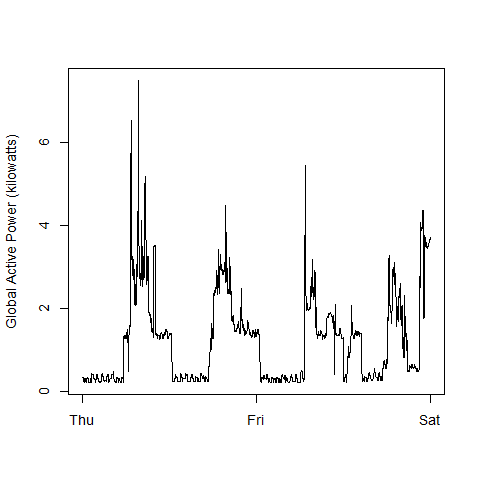
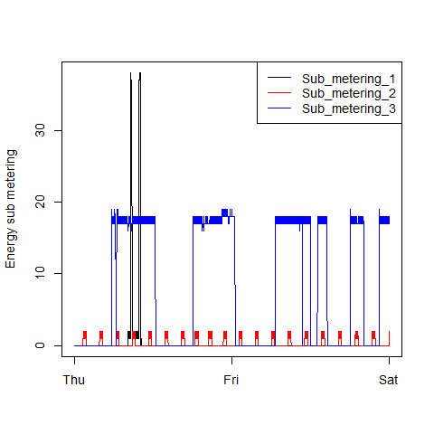
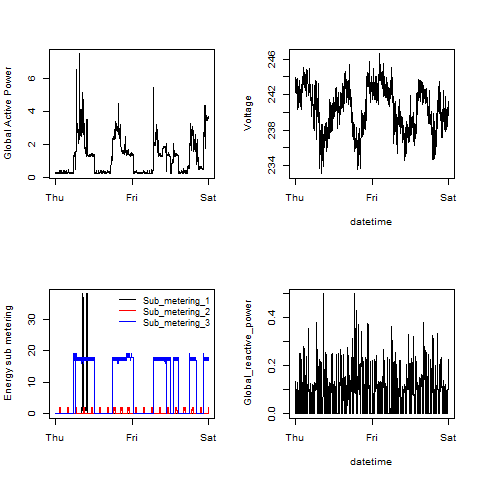

## How to run

1) Clone this repository (or download and extract a zipfile)
2) Set the working directory in RStudio to the repository path
3) Source plot1.R, plot2.R, plot3.R, plot4.R
4) You could reproduce the plots, by running plot1(), plot2(), plot3() and plot4(). On the first run, the datafile will be download, extracted and cleaned

### Plot 1

 

### Plot 2

 

### Plot 3

 

### Plot 4

 
